# agent-stack

**Tell it what to build. Get tested, reviewed, merged software back.**

agent-stack turns one Linux computer into a software team of AI coding agents. You talk to one agent, the operator:
"onboard this repo, here is what I want". It sets up a team for the project, the team plans the work, writes the tests
first, builds, uses the result the way a person would, has a second AI family review it, and merges it through a gate.
You approve the plan and the risky steps. Everything else runs on its own.

It is glue and configuration around existing tools: [OpenRig](https://www.npmjs.com/package/@openrig/cli) runs the
teams, Claude Code and Codex CLI are the agents' workspaces, [CLIProxyAPI](https://github.com/router-for-me/CLIProxyAPI)
pools your subscriptions, [TypeSafe Jev](https://typesafe.ai) makes the small typed decisions (who builds this, may
this merge), and Playwright gives the agents a real browser.

## Watch the fleet: rig-console

<p align="center">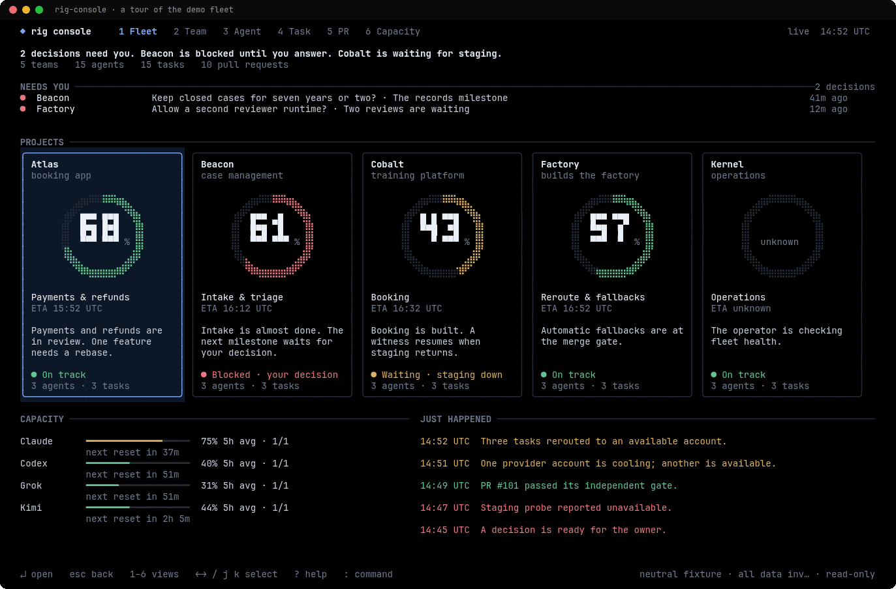</p>

`rig-console` is a full-screen, read-only console for every team on the machine. One screen tells you what is
working, what is stuck and why, what waits on you, how far each slice has got, and how much of each subscription is
left.

- **It answers "what needs me?" first.** Owner decisions lead the Focus view; the rest of the fleet is a pulse.
- **"Stuck" is earned, never a guess.** A seat is stuck only when it has been quiet for 15 minutes and none of its
  work has moved; the console always says why, with the ages.
- **It is safe to leave open.** It only reads the fleet (its one write is its own 24 h history file); it never
  touches tmux; it costs the daemon about 0.6% of one core.

Try it on the demo fleet, no team needed: `rig-console --fixture docs/fixtures/demo-fleet.json`. The gallery, keys and
more examples are in [rig-console in detail](#rig-console-in-detail).

## How it works

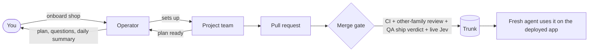

- **Operator.** An always-on agent in OpenRig's kernel rig. You talk to it; it sets up and watches the project teams.
- **Rig.** One project's team: a lead, an architect, test authors, builders, QA, reviewers of two AI families, and a
  merge owner. Four sizes: `core` (4 seats), `small` (10), `build` (14), `full-stack` (27).
- **Seat.** One agent with a role, its own git worktree and its own conversation, named `<pod>-<member>@<rig>` (for
  example `coord-lead-claude@shop`).
- **Queue.** Seats hand work to each other as queue rows; every row has one owner (`rig queue list`).
- **Merge gate.** A pull request merges only when CI, a review by the other AI family, QA's ship verdict for that exact
  commit and a live Jev decision all agree.
- **Witness.** After a wave of features merges, a fresh agent that built none of it uses them on the deployed app and
  records what it saw.

Six workflow skills set how every team verifies and writes: a feature map in `docs/VERIFY.md`, a real-user bug review
before merge, a blast-radius check on risky diffs, named review lenses, and plain writing. [docs/SKILLS.md](docs/SKILLS.md)
lists them with every other skill.

## Models and decisions

Each seat runs the model that suits its job. These are the defaults in every team template:

- architects: Claude Fable 5.1 (it bills your account's usage credits, outside the subscription pool);
- Codex builders: GPT-6.1 Sol; UI builders and locked-test authors: Claude Sonnet 5.5;
- reviewers: three AI families (Claude Opus 5.5, GPT-6.1 Sol, Kimi K3).

Jev makes the routine decisions: which seat builds a slice, whether a pull request may merge, and whether a working
seat is stuck. Code gathers the facts and sets the bar; anything Jev isn't sure about goes to the lead or to you.

```bash
# Illustrative: needs a running team (the README test checks each command and flag exists).
agent-dispatch pick-seat --rig shop --role implementer --task "03-login: sign-in form and session"
agent-merge-evidence 42 --mission m01-accounts --slice 03-login --deploy "merges deploy to production" --decide
agent-stuck-check --rig shop --dry-run
agent-reroute --rig shop
```

Why these models, and how the decisions are checked: [docs/REFERENCE.md](docs/REFERENCE.md#models-and-decisions).

## Talk to your operator

Attach to the operator's terminal and type, or send it a message:

```bash
# Illustrative: needs a running kernel rig (the README test checks each command and flag exists).
tmux attach -t operator-agent@kernel
rig send operator-agent@kernel "Onboard github.com/acme/shop: an existing Next.js app on Vercel and Neon. Small team. Fix issues #12 and #14."
```

Some conversations, and what happens next:

> **You:** Onboard github.com/acme/shop. It's an existing Next.js app on Vercel with a Neon database. Small team. Here
> are the issues to fix: #12 and #14.
>
> **Operator:** reads the repo (its README, CI, branch rules, the two issues), then asks in one message only what it
> can't find out: whether merges deploy to production, who approves the plan and the merges (default for merges: the
> other-family review plus live Jev, no approval per PR from you), and whether #14 may touch production data.

> **You:** Merges deploy to production, that's fine for now. No approval per PR. #14 needs my go before production.
>
> **Operator:** clones the repo, sets up a development database branch with its own password so no agent ever holds a
> production credential, runs `agent-project-onboard` (dry run first), starts a 10-seat team, writes your answers into
> the team's rules, and briefs the lead. When the lead reports the plan ready, the operator checks it (research in every
> slice, waves, a witness at the end of each wave, `docs/VERIFY.md`) and sends it to you to approve, unless you told it
> to approve plans for you. Builders start only after that.

> **You:** How is shop going?
>
> **Operator:** answers from the queue and the team's progress: what merged (with QA evidence), what is being built, and
> anything waiting for you.

> **You:** Start a new project: a booking site for a yoga studio. Here is my plan. Use a build team.
>
> **Operator:** creates a private GitHub repo with the starter kit, a 14-seat team, and the same plan review before any
> builder starts.

The operator follows the `project-onboarding` skill ([skills/project-onboarding/SKILL.md](skills/project-onboarding/SKILL.md)),
and asks you before anything in [What it never does without you](#what-does-it-never-do-without-me).

### A worked example

A real onboarding, anonymised: an existing Next.js app on Vercel and Neon, trunk `master`, deploy on merge, two GitHub
issues assigned to the owner. One was a scheduling change (store the actual job duration and use it for crew
allocation). The other was a production data cleanup.

1. The operator adopted the repo as it was: trunk `master`, its own required checks and its label-armed auto-merge.
   A local `main` ref mirrors `master` for OpenRig.
2. It created a Neon `dev` branch with its own password and a development Blob store. Seats got only `.env.local`.
   Production and preview env files stayed with the owner.
3. It started a `small` team (10 seats), wrote the plan from the owner's words and the issues, and recorded the owner's
   decisions in the team's CULTURE: never close an issue (comment and hand it back to its creator to re-test), no
   production data change without the owner's go, and merges deploy to production.
4. The lead turned the plan into one mission per issue. The schema change got its own wave. The data cleanup was
   rehearsed on a fresh database branch, and its report went to the owner as one decision request.

## Quick start

You need Linux, git, and accounts for GitHub and at least one of Claude or ChatGPT. Clone the repo and see what is
missing. The check installs and configures nothing (its small side effects are listed under "Check the machine"):

```bash
# Runs as shown (the README test runs this block in a throwaway HOME).
git clone https://github.com/korallis/agent-stack ~/Projects/agent-stack
cd ~/Projects/agent-stack && ./install.sh --check
```

Then install, and sign in to your accounts. Logins open a browser, so they can't be scripted:

```bash
# Illustrative: installs software and needs your accounts (the README test checks each command and flag exists).
./install.sh --apply
gh auth login
agent-login claude claude-a        # once per Claude subscription (claude-b, ...)
agent-login codex codex-a          # once per ChatGPT subscription
```

Paste your TypeSafe key into `~/.config/agent-stack/secrets/typesafe.env`. Then talk to your operator (above), or
create a project yourself (examples below).

## Examples

### Onboard a project from an answers file

The operator writes a small answers file from your conversation and runs the helper, a dry run first:

```bash
# Illustrative: needs your answers, plan and decisions files (the README test checks each command and flag exists).
cp ~/Projects/agent-stack/rig/template/onboarding/answers.example.env shop.env
agent-project-onboard shop.env
agent-project-onboard shop.env --apply
```

The dry run shows every step. `--apply` clones the repo, pulls only the Development env, creates the team, puts your
plan and decisions in place, and renders the lead's brief for the operator to review and send.

### Create a project for a new repo

See what it would create, without creating anything:

```bash
# Runs as shown (the README test runs this block in a throwaway HOME).
agent-project-new --name Demo --rig demo --no-github --identity "Demo Bot <bot@example.invalid>" --dry-run
```

Then create it for real. It makes a private GitHub repo with the starter kit, the team's workspace and one worktree per
seat, and starts the team:

```bash
# Illustrative: creates a GitHub repo and starts a team (the README test checks each command and flag exists).
agent-project-new --name MyApp --rig myapp --github <your-github-user>
agent-project-check MyApp
rig send coord-lead-claude@myapp "Build docs/PLAN.md"
```

Write `docs/PLAN.md` in `~/Projects/MyApp` and commit it before you send that message.

### Create a project for an existing repo

Clone the repo to `~/Projects/<Name>` first. `agent-project-new` then keeps its trunk, its branch rules and its files,
and puts the starter kit in `<Name>-work/starter-kit/` for the lead to adopt in a pull request:

```bash
# Runs as shown (the README test runs this block in a throwaway HOME).
git clone https://github.com/korallis/agent-stack ~/Projects/StackDemo
agent-project-new --name StackDemo --rig stackdemo --no-github --identity "Demo Bot <bot@example.invalid>" --dry-run
```

Drop `--dry-run` (and `--no-github`) to do it. Keep seats on development data: [docs/PROJECT-ENV.md](docs/PROJECT-ENV.md).

### Dispatch a slice

The lead normally does this. A slice is one buildable piece of a mission:

```bash
# Illustrative: needs a running team (the README test checks each command and flag exists).
rig queue create --destination impl-codex-1@myapp --mission m01-accounts --slice 03-login --summary "Build 03-login" --body-file dispatch.md
rig queue list --destination impl-codex-1@myapp
```

### Run the merge gate

The merge owner (the integrator seat) does this for every pull request, on its exact head commit. Each step stops the
run when its gate fails, so the last line runs only when every gate passed:

```bash
# Illustrative: needs a real pull request (the README test also runs it with stub gh and jev-decide, failing each gate).
(
  set -euo pipefail
  pr=42 repo='<owner>/<repo>' mission=m01-accounts slice=03-login
  head=$(gh pr view "$pr" --json headRefOid --jq .headRefOid)
  base=$(gh pr view "$pr" --json baseRefOid --jq .baseRefOid)
  gh pr checks "$pr" --required
  [ "$(gh api "repos/$repo/commits/$head/statuses" --jq '[.[] | select(.context == "independent-review")][0].state')" = success ]
  qa=$(python3 - "$OPENRIG_WORK_ROOT/missions/$mission/slices/$slice/proof/brb-$head.md" "$head" <<'PY'
import re, sys, yaml
try:
    m = re.match(r"---\n(.*?)\n---\n", open(sys.argv[1]).read(), re.S)
except OSError:
    sys.exit("no QA verdict for this head")
fm = (yaml.safe_load(m.group(1)) if m else None) or {}
if not (fm.get("artifact_type") == "qa" and fm.get("verdict") == "PASS" and str(fm.get("candidate_sha")) == sys.argv[2]):
    sys.exit("QA's verdict for this head is not a PASS")
print(fm["money_evidence"])
PY
  )
  jq -n --argjson pr "$pr" --arg head "$head" --arg base "$base" --arg qa "$qa" \
    '{pr: $pr, head: $head, base: $base, change: "Adds login", ci: "required checks pass",
      review: ("independent-review success; bug review board: " + $qa)}' > gate-input.json
  jev-decide review.merge_gate --input gate-input.json > gate.json
  jq -e '.decided_by == "jev" and .band == "act" and .result.decision == "merge"' gate.json
  gh pr merge "$pr" --squash --match-head-commit "$head"
)
```

The gates, in order:

1. `gh pr checks --required` fails unless every required check passed.
2. The status line fails unless the latest `independent-review` status on that head is `success`.
3. The Python step parses the YAML frontmatter of QA's bug-review-board proof for this head (`proof/brb-<head>.md`,
   written by `rig proof add`) and fails unless it is a `qa` artifact with verdict `PASS` for exactly this head. A NO,
   a missing file or a verdict for an older head stops the run. Its whole `money_evidence` (which `rig proof add` may
   wrap over several lines) is what Jev sees as QA's verdict.
4. The `jq -e` line fails unless live Jev (not a cache or a fallback) answered `merge` in the act band. `jev-decide`
   itself exits 0 for the review band too, so its exit code is not the gate.

`--match-head-commit` refuses the merge if the branch moved after the checks. The change summary (`"Adds login"`) is
the one line you write by hand.

### Relaunch a seat

Relaunch a seat only while it is idle. In its tmux pane, Codex quits with `Ctrl-U`, `/quit`, Enter; Claude with
`/exit`. Then:

```bash
# Illustrative: needs a running team (the README test checks each command and flag exists).
rig ps --json | jq -r '.[] | "\(.rigId) \(.name)"'
rig launch <rigId> impl.codex-1
rig seat status impl-codex-1@myapp
```

The seat resumes its own conversation. `docs/REFERENCE.md` says how to verify that.

### Add a secret for the browser

Test logins go in a file only you can read. Agents type them by name, so the value never appears in a transcript:

```bash
# Runs as shown (the README test runs this block in a throwaway HOME).
mkdir -p ~/.config/agent-stack/secrets
read -rsp 'Password for the MyApp test admin: ' v; echo
printf 'MYAPP_ADMIN_PASSWORD=%s\n' "$v" >> ~/.config/agent-stack/secrets/playwright.env; unset v
chmod 600 ~/.config/agent-stack/secrets/playwright.env
```

The browser tool reads the file when a seat starts: add every name a seat needs, then relaunch that seat once. Always
append; prefix names with the project.

### Check the machine

```bash
# Runs as shown (the README test runs this block in a throwaway HOME).
cd ~/Projects/agent-stack && ./install.sh --check
agent-skills-check
agent-credguard-check
```

`install.sh --check` lists what is missing and changes nothing: no file, directory, mode or backup under your HOME,
nothing in the repo, no service started, no package fetched (npm doesn't run at all). Claude Code and Codex are asked about their plugins and MCP
servers only once they have run in your HOME (the first run of either writes its own state). A full install needs
`./install.sh --apply`; `--help` prints the usage, and any other argument is refused. `agent-skills-check` prints one line per skill
source. `agent-credguard-check` shows which running seats have `neon` and `vercel` behind the credential guard. The
credential read guard (a PreToolUse hook for Claude and Codex seats) refuses printing `.env`, `*runtime-url*`, `*.pem`
and secrets files into a transcript: [docs/REFERENCE.md](docs/REFERENCE.md#credential-read-guard).

## rig-console in detail

Five views, a drill-in for any seat, a command bar and four themes. Every image here is drawn from the neutral demo
fleet in `docs/fixtures/demo-fleet.json` by `node console/docs/make-assets.mjs`, so they can be redrawn after any UI
change.

<table>
<tr>
<td width="50%">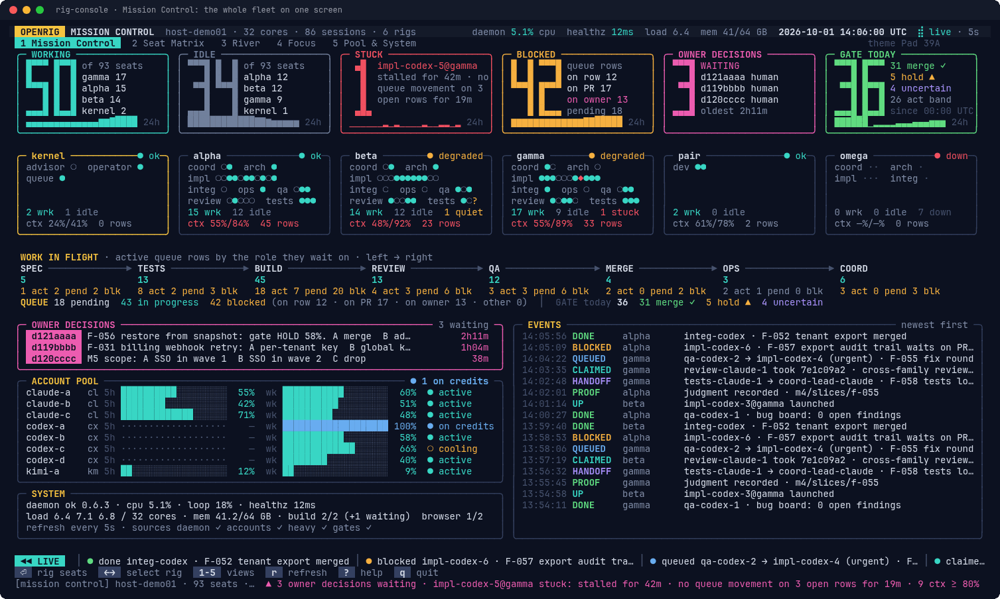<br><b>1 Mission Control.</b> Working, idle, stuck, blocked, owner decisions and today's merge-gate decisions; one card per rig; work in flight by role; the account pool; system health; the event log.</td>
<td width="50%">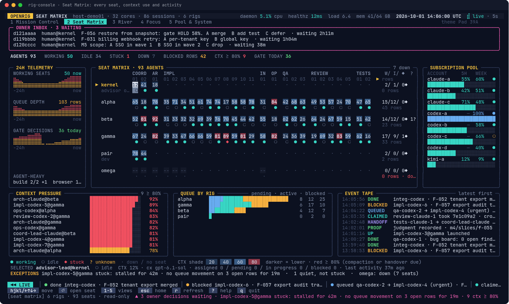<br><b>2 Seat Matrix.</b> Every seat of every rig: context use shaded (red at 80%), activity glyphs, 24 h telemetry, context pressure and the queue by rig.</td>
</tr>
<tr>
<td>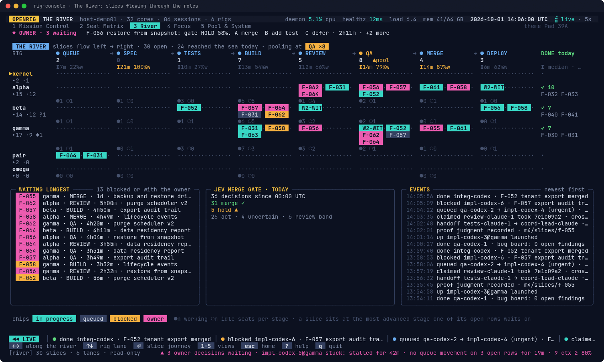<br><b>3 The River.</b> One lane per rig; each open slice sits at the stage its work waits on, with each stage's median time in state and the share spent waiting.</td>
<td>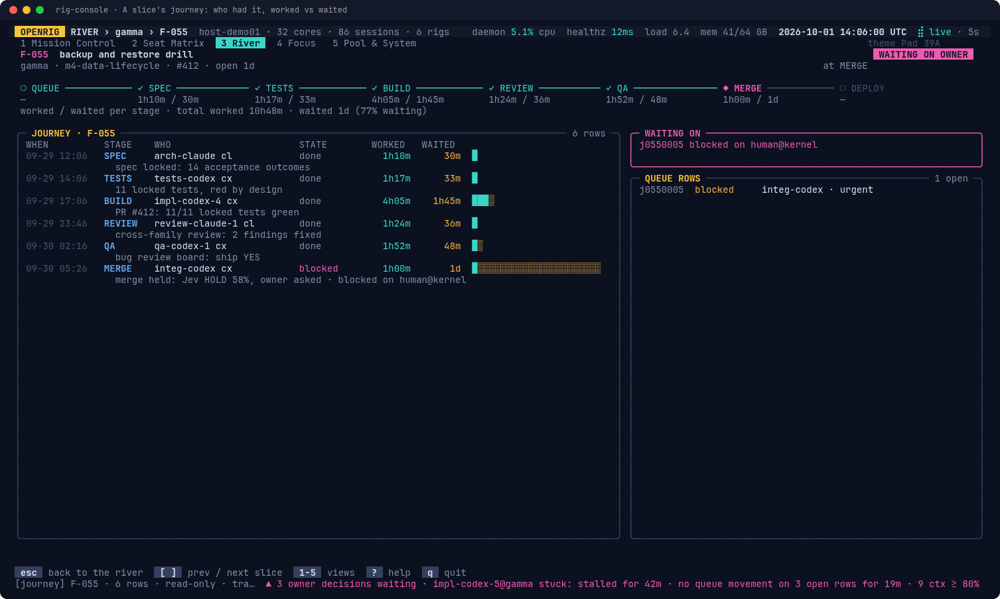<br><b>A slice's journey</b> (<code>⏎</code> on a slice): every row, who had it, worked vs waited per row and per stage, and what it waits on now.</td>
</tr>
<tr>
<td>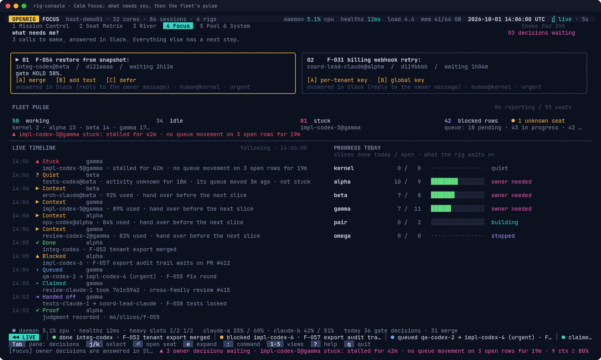<br><b>4 Focus.</b> What needs you first (answered in Slack, never from the console), then the fleet pulse, a live timeline and each rig's progress today.</td>
<td>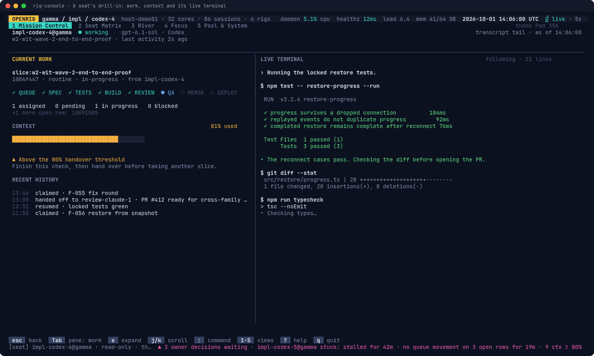<br><b>A seat's drill-in</b> (<code>⏎</code> on a seat, or <code>:seat &lt;name&gt;</code>): its work and slice stages, a context gauge, recent history and its live terminal.</td>
</tr>
<tr>
<td>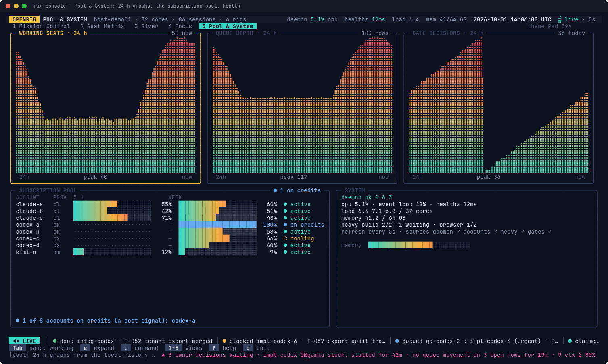<br><b>5 Pool &amp; System.</b> 24 h graphs, every subscription's 5-hour and weekly use (Codex has only a weekly window; accounts running on credits are counted), and system health.</td>
<td>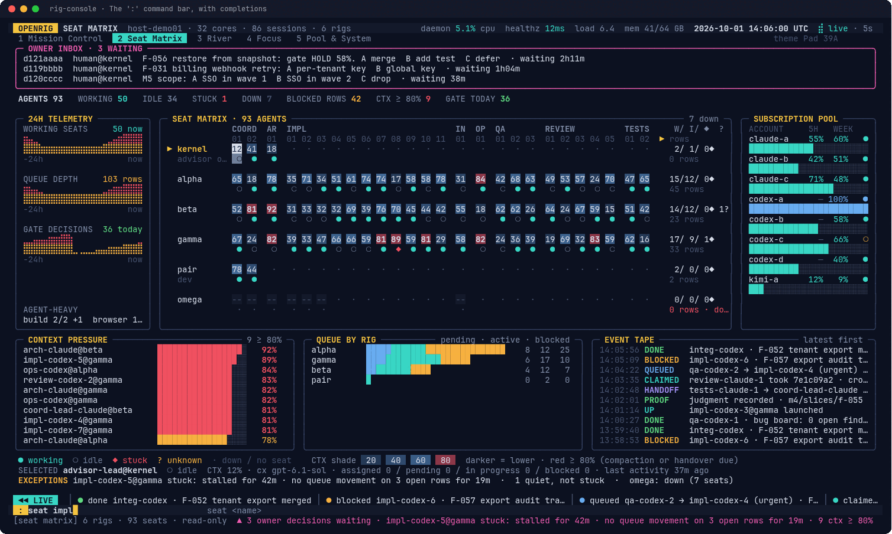<br><b>The <code>:</code> command bar.</b> Jump to a view, a seat, a rig or a slice, set the stuck threshold or the theme; <code>Tab</code> completes.</td>
</tr>
</table>

Four themes, shown at 120 columns (`--theme`, `:theme`, or `RIG_CONSOLE_THEME`):

<table>
<tr>
<td width="25%">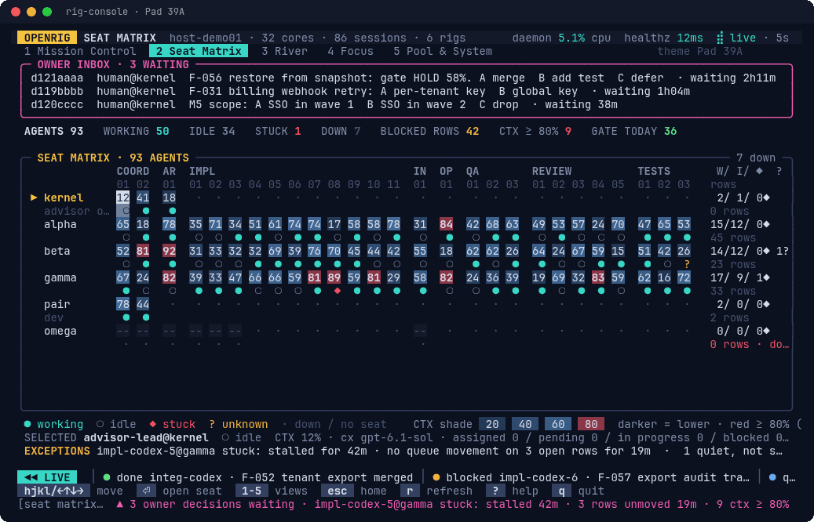<br>Pad 39A (default)</td>
<td width="25%">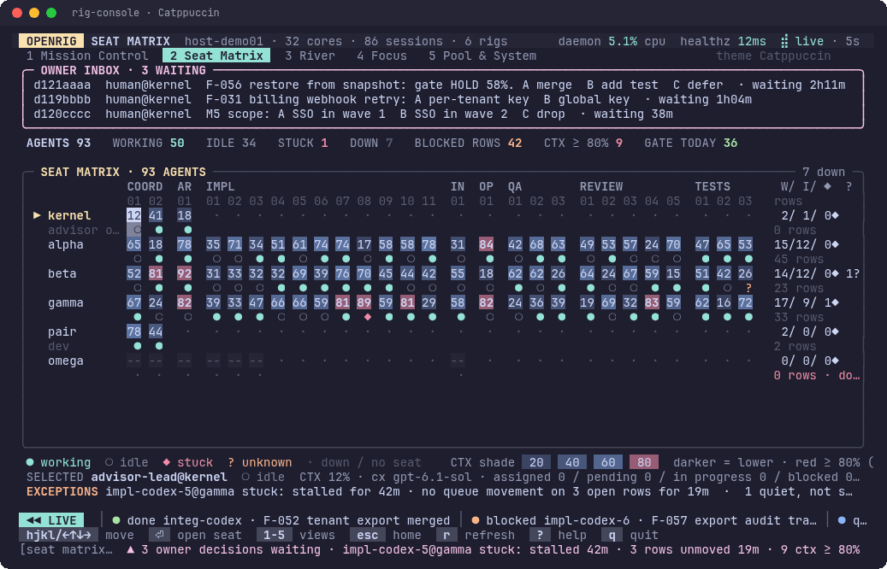<br>Catppuccin</td>
<td width="25%">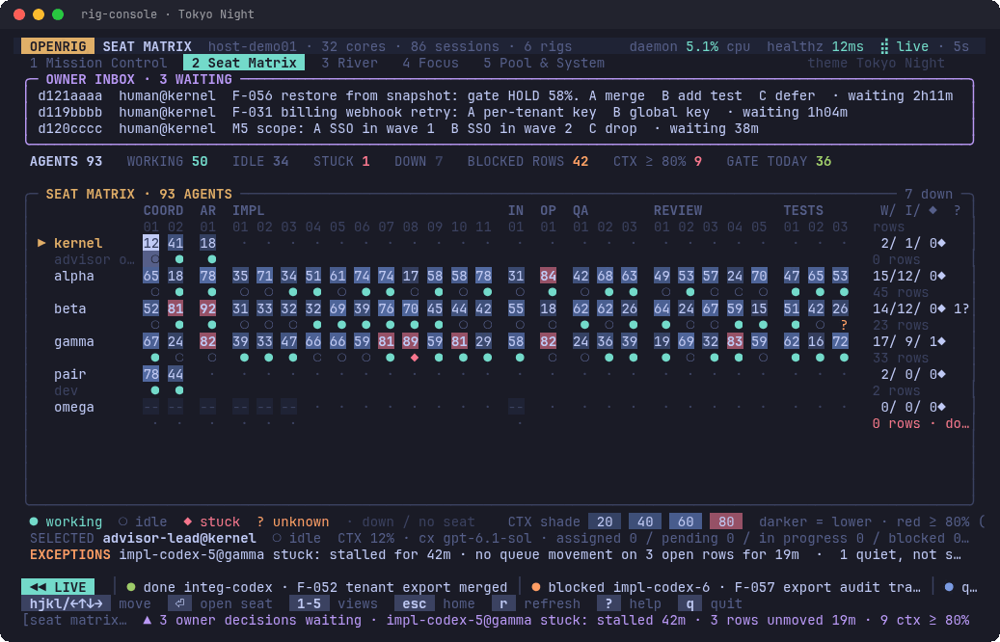<br>Tokyo Night</td>
<td width="25%">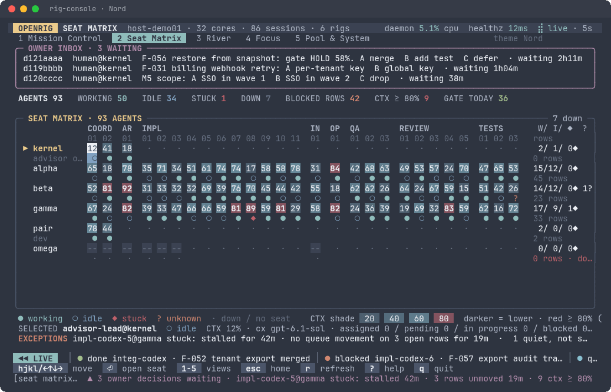<br>Nord</td>
</tr>
</table>

It fits smaller terminals too. Mission Control at 120 columns:

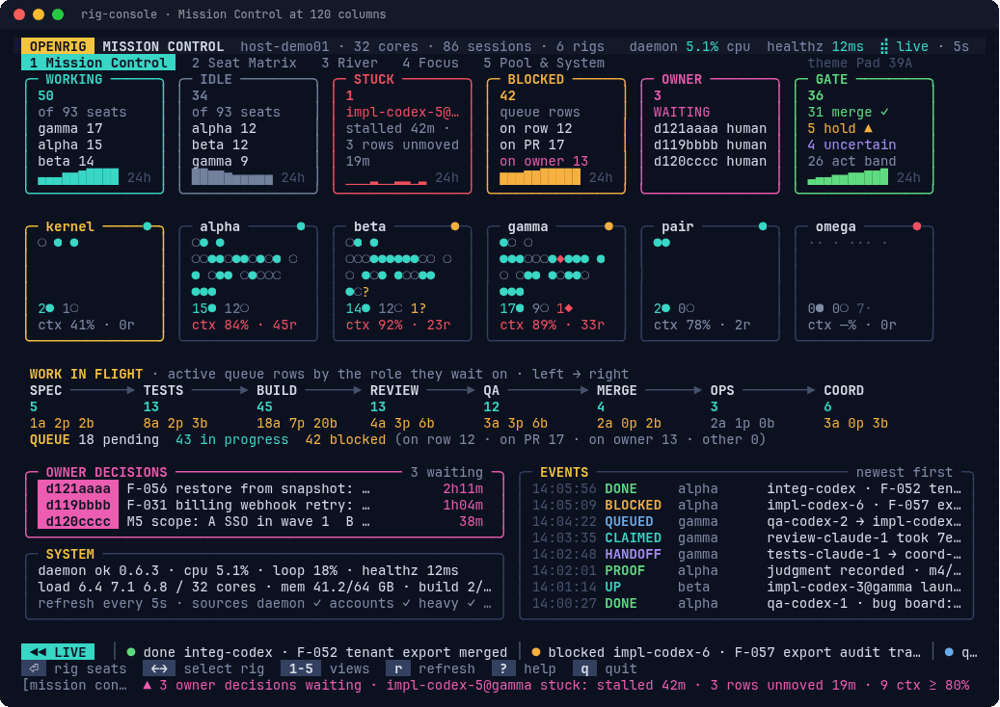

### Try it

Each line runs from a checkout on the demo fleet. No team, daemon or account is needed:

```bash
# Runs from a checkout (the README test runs every line; interactive ones also with --once).
cd ~/Projects/agent-stack
rig-console --fixture docs/fixtures/demo-fleet.json                                     # the demo fleet, full screen
rig-console --fixture docs/fixtures/demo-fleet.json --once --size 176x50 --view river   # one frame to stdout
rig-console --fixture docs/fixtures/demo-fleet.json --view matrix --theme tokyo-night
rig-console --fixture docs/fixtures/demo-fleet.json --view focus --stuck-minutes 10
rig-console --fixture docs/fixtures/demo-fleet.json --seat impl-codex-4@gamma
```

Inside the console, `:stuck 10` changes the stuck threshold and `:theme nord` the theme. On your own machine, with
OpenRig running:

```bash
# Illustrative: needs the OpenRig daemon (the README test checks each command and flag exists).
rig-console
rig-console --view focus --interval 10
```

### Keys

| Key | What it does |
| --- | --- |
| `1` to `5` | Mission Control, Seat Matrix, River, Focus, Pool & System |
| `←→↑↓` or `hjkl` | move between rigs, seats and slices |
| `⏎` | open: a rig's seats, a seat's drill-in, a slice's journey |
| `Tab` | next pane in Focus, Pool and a seat's drill-in |
| `e` | expand the focused pane (again to collapse) |
| `:` | the command bar: `home` `matrix` `river` `focus` `pool`, `seat <name>`, `rig <name>`, `slice <id>`, `stuck <minutes>`, `theme <name>` |
| `[` `]` | previous and next slice, in a journey |
| `j` `k` | select in a pane; scroll a seat's terminal |
| `esc` | back |
| `r` | refresh now |
| `?` | help |
| `q` | quit |

### How "stuck" is decided

A seat is **stuck** only when all three hold:

1. the daemon reports its activity as unknown, stalled or waiting for input;
2. its last activity is at least 15 minutes old (`--stuck-minutes`, `:stuck` or `RIG_CONSOLE_STUCK_MINUTES`);
3. none of its open queue rows, and none of its own queue moves, changed in those minutes.

Every verdict carries its reason and ages, for example `stalled for 42m · no queue movement on 1 open row for 38m`. A
quiet seat that misses one of them is shown as "quiet, not stuck", with why. A bare "stalled" label caused false
alarms before; the console never shows one.

### What it guarantees

- **Read-only.** It reads the daemon API and its live events, the Jev decision log, `agent-proxy-status` and
  `agent-heavy status`. The only files it writes are its own 24 h history and its lock (`~/.local/state/agent-stack/rig-console/`).
- **Never tmux.** It never polls tmux or asks the daemon to capture a pane. A seat's terminal is read from the
  transcript file the daemon already writes, and only while that seat is open.
- **Low load.** One cache refreshes every 5 seconds (never under 2) and backs off to 60 when the daemon is slow. The
  River and Focus also read the completed rows, every 5 minutes and only while one of them is open; a slice's
  transitions are read only while its journey is open. Measured on a running fleet: about 0.6% of one core of the
  daemon.

### Requirements

- Linux and Node 22.18 or newer, which runs TypeScript directly (`install.sh` installs `rig-console` on the pinned Node
  it uses for Jev).
- A terminal of at least 100×30; best at 176×50. Truecolor, with 256- and 16-colour and `NO_COLOR` fallbacks.
- For a live fleet, the OpenRig daemon on the same machine. The demo needs nothing else.

## FAQ

### What does it cost?
Your AI subscriptions (Claude and ChatGPT; Kimi optional), pooled through CLIProxyAPI, plus a TypeSafe key for Jev and a
machine that stays on. A bigger team can work on more slices in parallel and uses subscription time faster: pick
`small` for a handful of issues and `full-stack` only for a large new product. `agent-proxy-status` shows how each account is doing.

### Is it safe to run?
Seats run with permission checks off so they can work unattended, so run it on a machine and accounts you are
comfortable letting agents use. Agents get development credentials only: a development database branch with its own
password, a development file store, and browser logins typed by name so values never reach a transcript. A guard in
front of `neon` and `vercel` refuses to print connection strings or tokens.

### What does it never do without me?
It never touches production data or production env files, never changes branch protection or merge settings on an
existing repo, never adds seats beyond the agreed team, and never closes issues, publishes releases or changes
billing and domains. Risky pull requests (logins, payments, data deletion, database changes) wait for your OK unless
you gave standing approval.

### How do I watch it work?
`rig ps` lists the teams, `rig ps --nodes --rig <rig>` shows what each seat is doing, and `tmux attach -t <seat>`
shows one seat live. The lead sends a daily summary; decisions reach you as desktop notifications (and Slack, if set
up).

### Can it show me what it built, in Slack?
Yes, once Slack is set up (the operator does it with the onboarding skill). Owner updates and decisions arrive in your
Slack channel, and at the points worth seeing (a witness pass, a finished feature, a fix for a bug you reported) the
update carries a screenshot, a short video or a PDF in its thread. Captures use demo or test data only, never secrets
or real customer data. The Slack app needs the `files:write` and `files:read` scopes (to send proof and to read
files you send); see
[docs/REFERENCE.md](docs/REFERENCE.md) ("Slack proof").

### What kinds of projects fit?
Web apps, CLIs and APIs, new or existing. The team proves each feature through the interface its users use: a browser
for web apps, the command for a CLI, the HTTP API for an API.

## What changed lately

Each entry links its changelog note. [CHANGELOG.md](CHANGELOG.md) has the releases.

- **rig-console**, the fleet console above: [phase 1](changelog.d/WO78.md), [the River](changelog.d/WO78-phase2.md),
  [Focus, drill-in, Pool, commands and themes](changelog.d/WO78-phase3.md), [a conservative "stuck" and stage
  times](changelog.d/WO78-phase4.md).
- **Merge gate v4: tests-first only when it applies.** An ordinary pull request's diff is stated neutrally ("code
  change, N non-test paths"). The tests-first exception is checked only for a test author's `tests/<feature>` branch,
  so plain wording in a PR no longer pushes a green change toward a hold ([WO79](changelog.d/WO79.md)).
- **Fair heavy-run queue.** `agent-heavy` serves waiters first come, first served, and `--priority urgent|critical`
  puts critical-path QA and merge-gate re-runs ahead of routine work without stopping a running job
  ([WO81](changelog.d/WO81.md), [WO82](changelog.d/WO82.md)).
- **One Playwright MCP dir per seat**, with an hourly retention timer: 48 h, or 6 h for rigs that handle client data
  ([WO83](changelog.d/WO83.md), [unattributed files](changelog.d/WO83-unattributed.md)).
- **Quota readings you can trust.** `agent-proxy-status` reads each provider's units (Anthropic fractions, Codex
  percents) and Codex's windows by their length: Codex now has a weekly window only. An account that has used its
  window but has credits is shown "on credits" and stays eligible; one past its limit says `OVER`
  ([WO84](changelog.d/WO84.md), [WO85](changelog.d/WO85.md)). `cliproxy-quotawatch` follows the same rules, so it no
  longer warns that Codex seats will stall while they run on credits
  ([quotawatch](changelog.d/quotawatch-codex.md)).
- **`agent-project-check` reads big queues again** without timing out: the newest 20,000 rows without bodies, then a
  body only where a check needs one ([WO77](changelog.d/WO77.md)).

## Read more

- [docs/REFERENCE.md](docs/REFERENCE.md): the full team, what gets installed, everyday commands, several projects,
  operating a fleet, upgrades, and where everything lives.
- [docs/SKILLS.md](docs/SKILLS.md): every skill, where it comes from, and who gets it.
- [docs/PROJECT-ENV.md](docs/PROJECT-ENV.md): keeping agents on development data.
- [docs/UPGRADE.md](docs/UPGRADE.md): upgrading OpenRig. [docs/incidents/](docs/incidents/): what went wrong before.
- [config/tools.md](config/tools.md): every tool and version.
- Tests: `node --test 'test/*.test.js'` (on the owner's machine, through `agent-heavy build --`). GitHub Actions runs
  them on every pull request and on main ([.github/workflows/test.yml](.github/workflows/test.yml), check `test`).

## Read before you use it

- **Pooling consumer subscriptions through a proxy may break your providers' terms.** Anthropic's Claude Code terms
  prohibit it. If you pool anyway, that is your decision and your risk. `cliproxy-authwatch` alerts you if an account
  starts failing to sign in, and `fallback-codex.yaml` lets you keep working without Claude.
- **Seats run with permission checks off** so they can work unattended. Run this on a machine and accounts you are
  comfortable letting agents use, and never give seats production or cloud-admin credentials.
- **Quality comes from verification, not from the models.** The locked tests encode what "done" means, so read the
  feature list carefully before you approve it.
